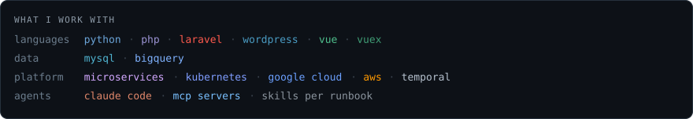

<!-- design: terminal -->

## Luciano Bosco — Software Engineer · 14+ years building backends · Málaga

Databases, data pipelines and the platforms behind video and stock content — and lately,
agents with MCP servers pointed at all of it. If I have to do something twice, I automate
it, so a good part of what I build is the tooling around the work rather than the work.

The long version of those years — the roles, the products, the things that cannot go in a
public repo — is on **[LinkedIn](https://www.linkedin.com/in/luciano-bosco/)**, which is also
the fastest way to reach me.

<picture>
  
</picture>

<details>
<summary>Terminal session transcript (text)</summary>

```console
luciano@mlg ~ $ whoami
luciano  -  Software Engineer, 14+ years building backends  -  Malaga, ES
# video and stock platforms. a few hundred thousand new assets a day.

luciano@mlg ~ $ bq query --nouse_legacy_sql 'SELECT count(*) FROM events.plays'
4113920684        -- 4.1 B rows, 41 GB scanned, 2.3 s
# writing that query is nothing. making it scan 41 GB instead of 4 TB is the job.

luciano@mlg ~ $ ingest-stats --today
  assets ingested   412 097        p99 end-to-end   41 s
# throughput you can buy. the p99 is the part you get paid for.

luciano@mlg ~ $ temporal workflow show -w ingest-2f9a --fields long
  3  ActivityTaskFailed      transcode   attempt 2   RetryState: InProgress
  7  ActivityTaskCompleted   transcode   attempt 3   14m22s
# a pipeline is not code that works. it is code that survives attempt 3.

luciano@mlg ~ $ curl -s traces/7c1e-ab3f | jq '.spans | length, .services | length'
94        12        -- 94 spans across 12 services, one upload
# microservices: the bug is never inside a service. it is between two of them.

luciano@mlg ~ $ claude mcp list
  databases    ready    read-only, 4 tools
  kubernetes   ready    read-only, 11 tools
  metrics      ready    read-only, 3 tools
# 2026: the agents get read-only credentials and one skill per runbook.
# it turns out the hard part was never the model. it was the plumbing.

luciano@mlg ~ $ mysql -h 10.24.6.11 -P 3306 -u readonly catalog
ERROR 2003 (HY000): Can't connect to MySQL server on '10.24.6.11:3306' (110)
# nothing at work is reachable from a laptop. that is the point.
luciano@mlg ~ $ tunnels-manager &
[gtk4] tunnels-manager 0.1.0  -  8 tunnels in ~/.config/tunnels-manager/
  catalog-db-prod       iap    13306   [ ==O ]
# if I have to do a thing twice, I automate it. this one I did 9 times a day.

luciano@mlg ~ $ mysql -h 127.0.0.1 -P 13306 -u readonly catalog
luciano@mlg ~ $ SELECT * FROM luciano.repos WHERE visibility = 'private';
ERROR 1142 (42000): SELECT command denied to user 'visitor'@'github'
-- 4 public repos. the other 14 years are on the other side of that error.

luciano@mlg ~ $ tail -2 ~/notes/still-figuring-out.md
  - whether p99 can be sold as a feature and not just an SLO
  - what breaks first the day ingest doubles
# 14 years in, that list only gets longer. that is the part I like.
```

The hostname and the table rows are invented; the constraint is not.

</details>

### What I work with

<picture>
  
</picture>

### The one thing that is public

The app in the session above is **[tunnels-manager](https://github.com/lucianobosco/tunnels-manager)**:
Google Cloud IAP tunnels and port-forwards, one switch per tunnel, the connection string a
click away. GTK4 and Python, 100% branch coverage of the logic, and it is pinned below.

Everything else I work on is on the other side of that `ERROR 1142`.

---

<sub>The terminal above is not a recording. It is a 40-line text file rendered into an
animated SVG by 200 lines of standard-library Python — no service, no dependency, nothing
to rate limit. Three more designs, and the research behind them, live in
<a href="designs/"><code>designs/</code></a>.</sub>
