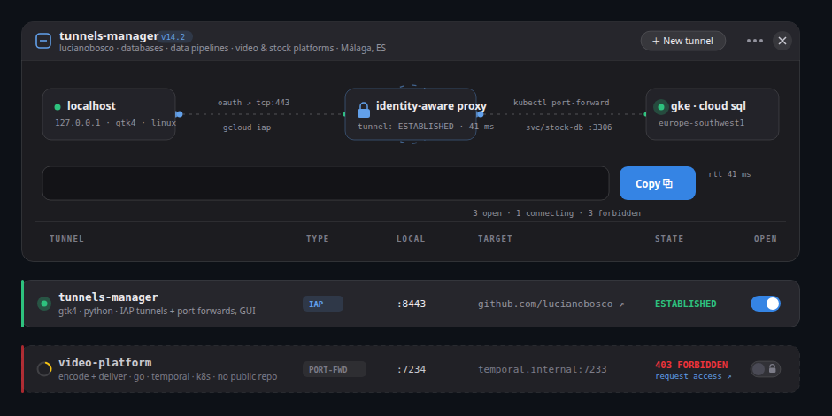

# Design: app-panel — the README *is* the app

**Built, not live.** The full design, including everything the research run decided and
rejected, is in [`../concepts/app-panel.md`](../concepts/app-panel.md). What lives here are
the SVGs that were actually built from it, recovered from the run so the work is not lost.



Three boxes and the wires between them: `localhost` → **identity-aware proxy** → `gke ·
cloud sql`, with blue packets crawling right along a dashed wire and green ACKs crawling
back, a dashed handshake ring rotating around the proxy, and a breathing LED on the far
end. Under the topology, the connection string and a **Copy** button; under that, a real
table header, and then one strip per repository — `tunnels-manager` open and green with its
switch on, the private ones stuck mid-handshake behind a padlock and a `403 FORBIDDEN` that
links to a prefilled access request.

## Why it is in strips

GitHub's sanitiser allows an `` per line but no nested markup, so a panel that needs
**each row to be its own link** cannot be one image. Each strip is a separate SVG, stacked
in the README, and only the row strips are wrapped in links. `head-*.svg` is the window
chrome plus the topology; `row-*.svg` are the repository rows.

Light and dark are separate files rather than a media query inside one SVG, because the
viewer's OS theme and their GitHub theme can disagree — `<picture>` with
`prefers-color-scheme` is what resolves it, and that only works from the outside.

```bash
xdg-open preview.html      # both themes, animated, in the browser
```

## What must be fixed before this could go live

The still frame above shows the bug: **the connection-string field and the latency
sparkline are empty.** Both are drawn by animations declared with `fill-mode: both` over a
static `opacity: 0`:

```css
animation: wipe 1.5s .35s cubic-bezier(.2,.8,.2,1) 1 both
animation: draw 1.6s  .3s ease-out 1 both
```

That breaks the rule the live design is built on — *never let an animation own the resting
state*. Anyone with `prefers-reduced-motion`, any renderer that ignores CSS animation, and
anyone arriving after the animation finished sees a panel with a blank field where its
whole point should be. The fix is the same as in
[`../terminal/render.py`](../terminal/render.py): declare the finished state statically and
let the animation borrow the element on the way in with `backwards`.

The scores are in [`../README.md`](../README.md): 6.7 against the terminal's 7.3. The
judges' objection was not the craft, it was that a fake application window invites the
question *"is any of this real?"*, while a transcript of pseudo-commands does not.
